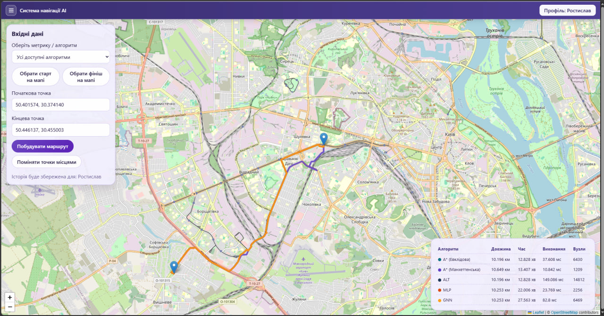
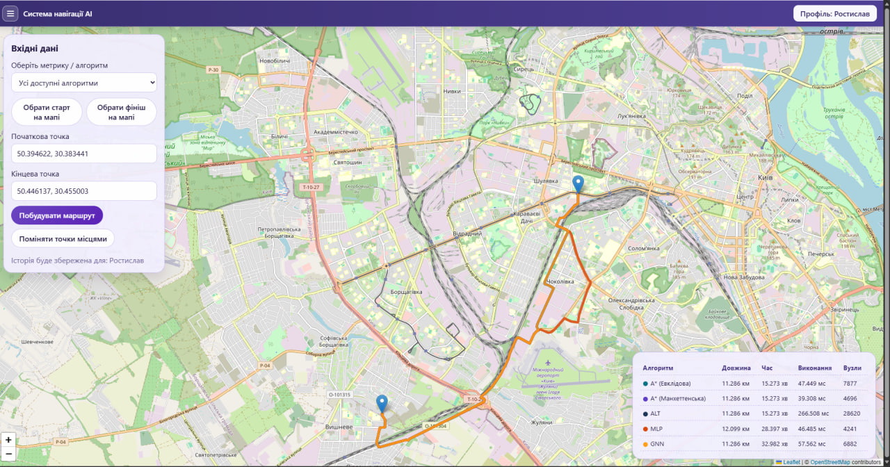
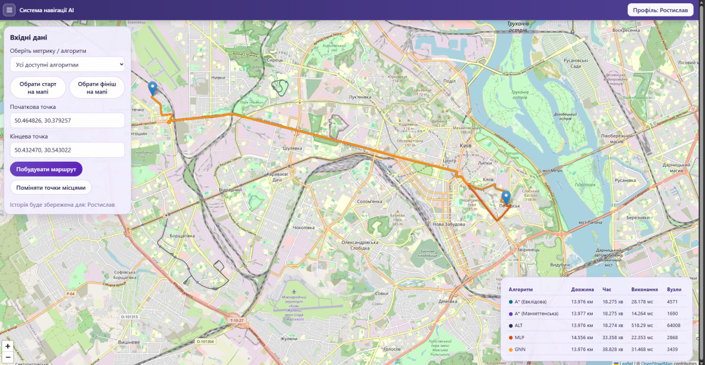
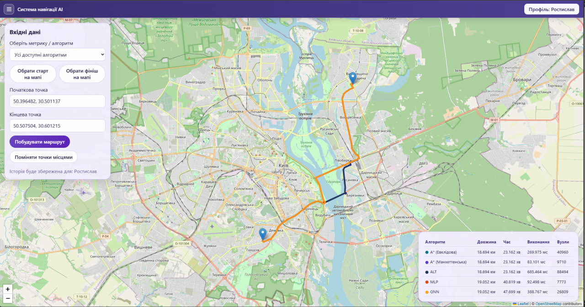

# Курсова робота з дисципліни «Штучний інтелект» та проєкт з дисципліни "Frontend"
### Тема: розробка навігаційного алгоритму А*
### Виконав студент групи КМ-32 Онофрей Ростислав

## Вступ

### Передмова

Сучасні навігаційні системи здебільшого розраховують маршрути індивідуально для кожного користувача, використовуючи "егоїстичні" алгоритми пошуку найкоротшого шляху. 
У теорії транспортних потоків відомий парадокс Браєса, який доводить: додавання нових доріг до мережі за умови егоїстичного розподілу водіїв може не зменшити, а навпаки - збільшити середній час подорожі, провокуючи утворення заторів.
Для вирішення цієї проблеми необхідний перехід від індивідуального пошуку шляху до системного управління транспортними потоками. 
Оскільки починати треба з меншого - ця курсова робота присвячена дослідженню базових можливостей А* алгоритму та аналізу перспектив його оптимізації. Вона має стати фундаментом моєї дипломної роботи, що вже досліджуватиме можливості системного управління транспортними потоками. 
 
### Ідея цієї курсової

- Дослідити А* зі стандартними просторовими евристиками
- Спробувати застосувати нейронні мережі для оптимізації результатів класичного виводу А* 
- Показати результат через веб-візуалізацію

## 1. Постановка задачі

### 1.1 Тема

Розробка навігаційного агента (А*) для пошуку оптимального шляху на графі міських доріг.


### 1.2 Мета

Реалізувати алгоритм та порівняти ефективність різних еврістичних функцій та підходів реалізації за якістю маршруту та обчислювальною ефективністю.

### 1.2 Завдання

1. Підготувати граф дорожньої мережі та базові ваги ребер.
2. Реалізувати A* з евклідовою і манхеттенською евристиками.
3. Реалізувати ALT з landmarks.
4. Підготувати датасет PEMS-BAY для навчання NN-моделей.
5. Інтегрувати передбачення моделей у ваги ребер.
6. Провести порівняльний експеримент.

### 1.3 Формальна постановка

Нехай дорожня мережа задана орієнтованим графом $G=(V,E)$, де:
- $V$ — множина вузлів (перехрестя/точки з’єднання),
- $E$ — множина ребер (дозволені дорожні переходи),
- $c(e)\ge 0$ — вартість проходження ребра $e$.

Для стартового вузла $s$ та цільового вузла $g$ потрібно знайти оптимальний шлях:

$$
P^*=\arg\min_{P\in\mathcal{P}(s,g)} J(P), \qquad
J(P)=\sum_{e\in P} c(e).
$$

Ідея A*:
- алгоритм розкриває вузли у порядку зростання пріоритету
$$
f(n)=g(n)+h(n),
$$

де $g(n)$ — уже відома вартість від $s$ до $n$, а $h(n)$ — евристична оцінка залишкової вартості від $n$ до $g$;
- множина `open` містить фронт пошуку (кандидати на розкриття), а `closed` — уже оброблені вузли;
- на кожному кроці обирається вузол із мінімальним $f(n)$ з `open`, після чого виконується релаксація його сусідів:
$$
g_{\text{new}}(m)=g(n)+c(n,m),
$$
і якщо $g_{\text{new}}(m)$ краще за поточне, то значення для $m$ оновлюються;
- алгоритм завершується, коли цільовий вузол $g$ дістається з `open` як мінімальний за $f$; у цьому разі відновлений шлях є кандидатом на оптимальний.

Щоб A* зберігав оптимальність, евристика має бути допустимою:

$$
h(n)\le h^*(n),
$$

де $h^*(n)$ — точна мінімальна залишкова вартість до цілі.

Ключові метрики оцінки:
- `distance_km`
- `time_min`
- `execution_ms`
- `expanded_nodes`

## 2. Аналіз існуючих методів


### 2.1 Комерційні продукти

#### 2.1.1 GraphHopper

Оpen-source рушій маршрутизації для графів доріг на базі OpenStreetMap, який можна використовувати як Java-бібліотеку або як окремий HTTP-сервіс. 

Типові сценарії застосування:
- побудова маршруту;
- матриці часу/відстаней;
- map matching (прив’язка GPS-треку до дорожнього графа);
- сервери навігації для веб і мобільних застосунків.

**Підходи пошуку шляху:**

1. Базовий пошук:
На неієрархічному графі GraphHopper використовує варіації Dijkstra/A* (зокрема двонапрямні версії) з урахуванням топологічних обмежень мережі.

2. Contraction Hierarchies (CH)
- Під час препроцесингу вузли послідовно «стискаються» за обраним порядком важливості.
- Щоб не втратити оптимальний шлях після вилучення вузлів, додаються shortcut-ребра.
- У фазі запиту пошук виконується по скороченому ієрархічному графу, тому різко зменшується кількість розкритих вузлів.
- Це дає дуже високу швидкодію на великих мережах.

3. Метод орієнтирів (Landmarks) і гібридні режими
- Для сценаріїв, де потрібно більше runtime-гнучкості та врахування змін графу (наприклад, затори), застосовується landmark-евристика (ALT-подібний підхід).
- Landmarks дають добру нижню оцінку вартості до цілі, прискорюючи A*.

**Переваги:**
- Дуже висока швидкість у CH-режимі на великих картах.
- Зріла промислова реалізація та надійна інтеграція з OSM.
- Чітке розділення режимів роботи для різних продуктних потреб.

**Недоліки:**
- Препроцесинг CH може бути дорогим за часом і ресурсами.
- Часті зміни ваг/правил інколи вимагають оновлення підготовлених структур.
- У більш гнучких режимах швидкість нижча, ніж у «чистому» CH.

### 2.1.2 Valhalla

Оpen-source routing engine, спочатку створений у Mapbox, а нині підтримуваний спільнотою. Основна мова реалізації — C++. Рушій орієнтований на побудову маршрутів, навігаційних інструкцій, map matching, ізохрон, матриць часу/відстаней і мультимодальних сценаріїв (авто, пішки, вело, транзит).

Типова сильна сторона Valhalla — робота зі складними правилами руху та багатою моделлю вартості маршруту:
- вартість ребра та маневрів обчислюється під час запиту залежно від профілю;
- той самий граф можна гнучко переоцінювати під різні політики маршрутизації.

**Підходи реалізації:**

1. Tile-based routing architecture
- Граф зберігається у вигляді тайлів (tiles), організованих ієрархічно.
- Це покращує локальність доступу до даних і зменшує витрати пам’яті при роботі з великими територіями.

2. Динамічний A* 
- Пошук шляху виконується A*-подібними алгоритмами (у тому числі двонапрямними модифікаціями).
- Підсистема costing (Sif) у runtime рахує вартість ребер/переходів з урахуванням типу руху, обмежень, поворотів, штрафів, історичного або живого трафіку.
- Евристика масштабується відповідно до моделі вартості, щоб зберігати ефективність пошуку.

3. Ієрархічний обхід мережі
- Для далеких ділянок маршруту алгоритм частіше рухається по вищих класах доріг.
- Біля старту/фінішу виконується детальніше опрацювання локальної мережі.
- Такий підхід скорочує простір пошуку без втрати практичної якості маршруту.


**Переваги:**
- Підтримка мультимодальних і спеціалізованих сценаріїв.
- Добра масштабованість на великих графах завдяки tile-архітектурі.

**Недоліки:**
- Складніший поріг входу: конфігурація і tuning.
- Якість результату сильно залежить від повноти та чистоти вхідних атрибутів.

### 2.2 Загальні підходи

#### 2.2.1 A* з евклідовою евристикою

Використовується геометрична оцінка часу до цілі за прямою.

$$
h_E(n,g)=\frac{\|p_n-p_g\|_2}{v_{ref}},
\qquad
\|p_n-p_g\|_2 \approx 111000\cdot\sqrt{(\Delta lat)^2+(\Delta lng)^2}.
$$


#### 2.2.2 A* з манхеттенською евристикою

Оцінка відбувається за двома осями.

$$
h_M(n,g)=\frac{|x_n-x_g|+|y_n-y_g|}{v_{ref}}
\approx
\frac{111000\cdot\left(|\Delta lat|+|\Delta lng|\right)}{v_{ref}}.
$$


#### 2.2.3 ALT (A* + Landmarks + Triangle inequality)

Тут відмінність полягає у способі побудови евристики: замість локальної геометрії використовується попередньо обчислена інформація про відстані до/від опорних вузлів (landmarks).

$$
h_{ALT}(n,g)=\max_{\ell\in L}\Big(d(\ell,g)-d(\ell,n),\ d(n,\ell)-d(g,\ell),\ 0\Big).
$$

У цій реалізації набір landmarks формується автоматично з геометрії поточного графа. Функція `_extract_landmark_nodes` бере `node_positions=(node_id, lat, lng)` і обирає до 4 крайніх вузлів:

$$
L=\{
\arg\min (lat+lng),\\
\arg\max (lat+lng),\\
\arg\min (lat-lng),\\
\arg\max (lat-lng)
\},
$$

після чого дублікати видаляються.

Далі для кожного landmark попередньо обчислюються **дві таблиці найкоротших відстаней** (алгоритм Дейкстри, вага `free_flow_time`):
- таблиця прямого напряму
$$
D^{from}_{\ell}(v)=d_G(\ell,v),
$$
тобто відстань від landmark до вузла;
- таблиця зворотного напряму
$$
D^{to}_{\ell}(v)=d_G(v,\ell),
$$
тобто відстань від вузла до landmark .

Пошук як процедура лишається A*, але зазвичай потребує менше розкритих вузлів завдяки сильнішій нижній межі.

#### 2.2.4 MLP + A*

У цьому підході нейромережа оцінює штрафи ребер, а пошук маршруту виконується класичним A*.

MLP дає прогноз штрафу $\hat p_e$, після чого вага ребра модифікується:

$$
t_e^{mlp}=t_e^{free}\cdot(1+\hat p_e).
$$

Евристична частина лишається евклідовою:

$$
f_{mlp}(n)=g_{mlp}(n)+h_E(n).
$$


#### 2.2.5 GNN (GCN) + A*

Логіка аналогічна MLP: GNN не шукає шлях напряму, а формує штрафи, які вбудовуються у ваги ребер. Різниця з MLP у тому, що GNN враховує контекст сусідніх вузлів під час оцінки.

Після прогнозу штрафу:

$$
t_e^{gnn}=t_e^{free}\cdot(1+\hat p_e^{gnn}).
$$

Пошук знову виконується стандартним A* з евклідовою евристикою:

$$
f_{gnn}(n)=g_{gnn}(n)+h_E(n).
$$


### 2.8 Порівняльний висновок по методах

- A* (Евклідова) — стабільний базовий еталон з мінімальною складністю впровадження.
- A* (Манхеттенська) — корисний варіант для квазі-сіткових районів, де рух ближчий до осьових напрямків.
- ALT — посилює A* більш інформативною евристикою і зменшує пошук у ширину.
- MLP — гнучко враховує локальні edge-ознаки, але слабше моделює глобальний графовий контекст.
- GNN (GCN) — краще враховує топологічне оточення, проте чутливий до якості вузлових ознак і схеми нормалізації.


## 3. Архітектура агентів та середовищ

### 3.1 Тип агента та архітектурні ролі

У роботі використано цільовий агент (goal-based) з utility-компонентою:

- goal-частина: дістатися від старту до цілі в дорожньому графі;
- utility-частина: зробити це з мінімальною вартістю (переважно за часом).

Архітектурно сервіс має дві логічні ролі:

- пошукова роль: A* (у різних варіантах евристики) виконує сам пошук шляху;
- оціночна роль: MLP/GCN оцінюють штрафи ребер, які уточнюють вагу перед запуском A*.

Тобто ML-блок не замінює A*, а підсилює його через кращу оцінку вартості кроку.

### 3.2 A* агент (базовий пошуковий агент)

**P (Performance):**
- мінімізувати сумарний час маршруту;
- зберігати оптимальність за умови коректної евристики;
- зменшувати `expanded_nodes` і `execution_ms`.

**E (Environment):**
- орієнтований граф доріг $G=(V,E)$;
- у вузлах: `lat`, `lng`;
- у ребрах: `free_flow_time`, `length_m`, `bpr_time` та інші транспортні атрибути.

**A (Actuators):**
- вибір вузла з мінімальним $f(n)=g(n)+h(n)$ з `open`;
- релаксація сусідів та оновлення `g_score`, `came_from`;
- відновлення маршруту після досягнення цілі.

**S (Sensors):**
- старт/фініш запиту;
- локальна суміжність поточного вузла;
- поточні ваги ребер та евристична оцінка до цілі.

Вхід/вихід агента:
- вхід: $(s,g,G,w,h)$;
- вихід: маршрут (послідовність вузлів), `distance_km`, `time_min`, `execution_ms`, `expanded_nodes`.

### 3.3 MLP-агент оцінювання штрафів (PEAS)

Задача MLP-агента - оцінити штраф ребра $\hat p_e$, після чого A* працює на вазі
$$
t_e=t_e^{free}(1+\hat p_e),
$$
із евклідовою евристикою.

**P (Performance):**
- мінімізувати помилку прогнозу штрафу (MAE/RMSE на test);
- покращити якість маршруту після інтеграції штрафів у A*.

**E (Environment):**
- навчальне середовище: PEMS-BAY (часові ряди + сенсорний граф);
- runtime-середовище: OSM-граф Києва з реберними проксі-ознаками трафіку.

**A (Actuators):**
- під час навчання: forward/backward оновлення параметрів $\theta$;
- під час інференсу: обчислення $\hat p_e$ для кожного ребра та передача ваг у A*.

**S (Sensors):**
- під час навчання MLP входять тензори:
  - $X_{mlp}\in\mathbb{R}^{N\times F}$, де $F=6$ (speed proxy, occupancy proxy, cyclical time features);
  - $y_{mlp}\in\mathbb{R}^{N\times 1}$ (цільовий penalty);
  - статистики нормалізації $(\mu_X,\sigma_X,\mu_y,\sigma_y)$;
- під час runtime: реберні ознаки поточного OSM-графа в тій самій структурі ознак.

Вхід/вихід агента:
- вхід: $X_{mlp}$ (або runtime-вектор $\mathbf{x}_e$);
- вихід: `mlp.pt` (після навчання) та $\hat p_e$ / `mlp_time` (у runtime).

### 3.4 GCN-агент оцінювання штрафів (PEAS)

GCN-агент (реалізація GCN) також не будує маршрут напряму. Він спочатку прогнозує вузлові penalty з урахуванням сусідства, потім переводить їх у реберні штрафи, і вже після цього маршрут шукає A*.

**P (Performance):**
- мінімізувати помилку прогнозу penalty на вузлах/ребрах;
- стабільно переносити інформацію про топологічний контекст у ваги для A*.

**E (Environment):**
- навчальне середовище: сенсорний граф PEMS-BAY;
- runtime-середовище: OSM-граф із побудованою нормалізованою суміжністю.

**A (Actuators):**
- message-passing кроки GCN та оновлення параметрів під час навчання;
- генерація вузлових $\hat p_v$, агрегація у реберні $\hat p_{uv}$, передача `gnn_time` в A*.

**S (Sensors):**
- під час навчання GCN входять:
  - $X_{gnn}\in\mathbb{R}^{T\times |V_{pems}|\times F}$ — часові батчі вузлових ознак;
  - $A_{pems}\in\{0,1\}^{|V_{pems}|\times |V_{pems}|}$ — матриця суміжності сенсорного графа;
  - $\hat A=D^{-1/2}(A+I)D^{-1/2}$ — нормалізована матриця для propagation;
  - $y_{gnn}\in\mathbb{R}^{T\times |V_{pems}|}$ або еквівалентна форма цілей penalty;
- під час runtime: вузлові проксі-ознаки поточного OSM-графа та його розріджена суміжність.

Вхід/вихід агента:
- вхід: $(X_{gnn},\hat A)$;
- вихід: `gnn.pt` (після навчання) та `gnn_time` через реберний penalty (у runtime).


## 4. Програмна реалізація

### 4.1 Технічний стек проєкту

| Категорія | Технологія / інструмент | Призначення |
|---|---|---|
| Frontend (базове) | HTML5, CSS3, JavaScript (ES Modules, JSX) | Розмітка, стилі, клієнтська логіка |
| Frontend (UI) | React 18 (`react`, `react-dom`) | Компонентна побудова інтерфейсу |
| Карта | Leaflet 1.9.4, React-Leaflet 4.2.1 | Візуалізація карти, маркерів, ліній маршруту |
| Frontend build/dev | Vite 5, `@vitejs/plugin-react`, npm scripts (`dev`, `build`, `preview`) | Локальна розробка та production-збірка MPA |
| Backend API | Python 3, FastAPI, Uvicorn | HTTP API, маршрутизація запитів, запуск сервера |
| Backend валідація | Pydantic v2 | Валідація та нормалізація вхідних даних |
| Графи та алгоритми | NetworkX | Представлення графа, shortest-path структури |
| ML/науковий стек | NumPy, Pandas, Matplotlib, PyTorch | Підготовка даних, тренування MLP/GCN, аналіз метрик |
| Навчальний датасет | PEMS-BAY (Augmented), CSV-файли | Часові ряди сенсорів і графова топологія для навчання |
| Дані моделей | `.pt` (PyTorch) | Збереження робочих ваг моделей для backend-інференсу |
| Прикладні дані | JSON (`users`, `articles`, `comments`, `history`) | Просте прикладне сховище без СУБД |
| Джерело дорожнього графа | OpenStreetMap Overpass API (через `urllib`) | Завантаження OSM-даних для побудови графа |
| Дослідження | Jupyter Notebook | Експерименти, навчання, порівняння алгоритмів |

### 4.2 Модульна структура проєкту

```text
project-root/
├── backend/
│   ├── main.py                              # FastAPI API + маршрутизація + ML-інференс
│   ├── requirements.txt                     # Python-залежності
│   ├── config/
│   │   └── routing_config.json              # конфігурація маршрутизації/кешу/ML-параметрів
│   ├── data/
│   │   ├── users.json
│   │   ├── comments.json
│   │   ├── articles.json
│   │   └── history.json
│   └── models/
│       ├── mlp.pt                           # навчений MLP для прогнозу реберного penalty
│       └── gnn.pt                           # навчена GCN-модель для прогнозу вузлового penalty
├── data/
│   ├── traffic_data/
│   │   ├── speed.csv                        # часові ряди швидкостей (PEMS-BAY)
│   │   └── occupancy.csv                    # часові ряди occupancy (PEMS-BAY)
│   ├── sensor_graph/
│   │   ├── sensor_metadata.csv              # метадані сенсорів (id, координати, напрям)
│   │   └── distances_bay_2017.csv           # відстані між сенсорами (ребра графа)
│   └── ml_artifacts/
│       └── pems_bay/                        # таблиці/криві/службові результати навчання
├── cache/                                   # OSM-cache для прискорення повторних маршрутів
├── notebooks/
│   └── kursova_a_star.ipynb                 # підготовка даних, тренування MLP/GCN, порівняння 5 методів
└── frontend/
    ├── package.json                          # npm-залежності та скрипти
    ├── vite.config.js                        # конфігурація Vite
    ├── html/                                 # HTML-сторінки MPA
    ├── css/                                  # глобальні стилі
    └── src/                                  # React-код застосунку
        ├── core/                             # API-клієнт, shell, сесія
        ├── entries/                          # entry points сторінок
        ├── pages/                            # компоненти сторінок
        └── components/
            ├── layout/                       # header/layout компоненти
            ├── map/                          # LeafletRouteMap
            └── articles/                     # модуль статей
```

### 4.3 Побудова маршрутизаційного графа з OSM


У runtime система працює тільки з OSM-графом. Логіка побудови така:

1. Для пари точок старт/фініш підбирається кеш, який покриває обидві точки (пріоритет менших bbox).
2. Якщо покриття не знайдено, виконується автодозавантаження bbox через Overpass API.
3. Із `node`/`way` формується орієнтований граф `G=(V,E)` з урахуванням `oneway`.
4. Для кожного ребра обчислюються `length_m`, `free_flow_time`, `bpr_time`, `centrality`, `capacity`, `volume`.
5. Будується spatial-index для nearest-node, а прив'язка точок виконується з урахуванням зв'язності компонент графа.


### 4.4 Загальна інформація

#### 4.4.1 BPR-модель перевантаження

У генерації атрибутів ребра застосовано BPR (Bureau of Public Roads) як базову модель «ціна перевантаження»:

$$
t_e^{bpr}=t_e^{free}\left(1+\alpha\left(\frac{v_e}{c_e}\right)^\beta\right),
\qquad \alpha=0.15,\ \beta=4.
$$

BPR відповідає на питання: як змінюється час на ребрі, коли відношення потоку до ємності $\frac{v_e}{c_e}$ зростає.
- якщо $\frac{v_e}{c_e}\ll 1$, множник у дужках близький до 1, тобто час майже вільнопотоковий;
- якщо $\frac{v_e}{c_e}\approx 1$, час вже помітно зростає;
- якщо $\frac{v_e}{c_e}>1$, зростання стає різко нелінійним.

Ролі коефіцієнтів:
- $\alpha$ задає «масштаб» штрафу за перевантаження (наскільки сильно крива піднімається вгору);
- $\beta$ задає «крутість» кривої (наскільки різко росте час біля та після межі ємності).

Для класичного набору $\alpha=0.15,\beta=4$:
- при $v_e=c_e$ отримаємо $t_e^{bpr}=1.15\cdot t_e^{free}$ (приблизно +15%);
- при перевищенні ємності приріст часу росте значно швидше, ніж лінійно.

Ємність і обсяг потоку в реалізації задаються через локальну «центральність» вузла:

$$
centrality=\max\left(0.15,\ 1-\min(1, radial)\right),
$$
$$
c_e = 850 + 900\cdot centrality,
\qquad
v_e = c_e\cdot(0.52+0.88\cdot centrality).
$$

Потрібна була фізично правдоподібна базова вага, чутлива до перевантаження, без зовнішнього live-трафіку. Тому використано класичну BPR-форму та просту параметризацію через геометричну наближеність до центру карти.

Параметри кривої $\alpha,\beta$ в загальному випадку знаходять калібруванням на спостереженнях часу:
$$
\min_{\alpha,\beta}\sum_i w_i\left(\frac{t_i^{obs}}{t_i^{free}}-1-\alpha\left(\frac{v_i}{c_i}\right)^\beta\right)^2,
\qquad \alpha\ge 0,\ \beta\ge 1.
$$
У цій реалізації зафіксовано класичне наближення $\alpha=0.15,\beta=4$, а адаптація під поточні умови виконується додатково через ML-penalty та BPR-blend.

#### 4.4.2 Ціль оптимізації маршруту

Всі режими приводяться до єдиної задачі пошуку найменшої сумарної вартості шляху:

$$
P^* = \arg\min_{P \in \mathcal{P}(s,g)} J(P), \qquad
J(P)=\sum_{e \in P} w_e.
$$

Бекендовий пошук працює з вагою ребра `weight_key`, тому всі алгоритми порівнюються коректно в одній постановці, змінюється лише визначення $w_e$.

#### 4.4.3 Визначення довжини ребра та базовий час

Довжина ребра обчислюється через haversine:

$$
d_{hav}=2R\arctan\frac{\sqrt{a}}{\sqrt{1-a}}, \quad
a=\sin^2\frac{\Delta\varphi}{2}+\cos\varphi_1\cos\varphi_2\sin^2\frac{\Delta\lambda}{2}.
$$


Після цього базовий час проходження ребра:

$$
t_e^{free}=\frac{d_{hav}}{v_e}.
$$

У графі є координати вузлів, тому спершу потрібно перевести геометрію в метри; далі маршрутизація у проєкті порівнює режими за часом (`time_min`), отже вага має бути часовою.

#### 4.4.4 A* та класичні евристики

Базовий пріоритет пошуку:

$$
f(n)=g(n)+h(n).
$$

Евклідова евристика:

$$
h_E(n,g)=\frac{111000\cdot\sqrt{(\Delta lat)^2+(\Delta lng)^2}}{v_{ref}},
\qquad v_{ref}=15\ \text{м/с}.
$$

Манхеттенська евристика:

$$
h_M(n,g)=\frac{111000\cdot\left(|\Delta lat|+|\Delta lng|\right)}{v_{ref}}.
$$

Оскільки реберні ваги зберігаються у секундах, евристика також має бути в секундах. Це забезпечує узгодженість одиниць вимірювання і стабільну поведінку A*.

#### 4.4.5 ALT-евристика

$$
h_{ALT}(n,g)=\max_{\ell\in L}\left(d(\ell,g)-d(\ell,n),\ d(n,\ell)-d(g,\ell),\ 0\right).
$$

Визначення landmark-вузлів:
- вхід: `node_positions = [(node_id, lat, lng), ...]`;
- вибір: 4 геометрично крайні вузли за критеріями `min/max(lat+lng)` та `min/max(lat-lng)`;
- дублікати вузлів видаляються;
- далі для кожного landmark обчислюються дві таблиці: $D^{from}_{\ell}(v)=d_G(\ell,v)$ (прямий напрям) і $D^{to}_{\ell}(v)=d_G(v,\ell)$ (зворотний напрям) через `nx.single_source_dijkstra_path_length` на прямому та реверсному графі відповідно.

Такі landmarks швидко дають «кутове» покриття області графа без складної оптимізації вибору опорних вершин. Через нерівність трикутника таблиці дають сильнішу нижню оцінку і зменшують число розкритих вузлів.

### 4.5 Підготовка даних 

#### 4.5.1 Підготовка датасету PEMS-BAY для навчання

Для навчання використовуються:

1. `data/traffic_data/speed.csv` — часові ряди швидкості по сенсорах.
2. `data/traffic_data/occupancy.csv` — часові ряди завантаженості (occupancy).
3. `data/sensor_graph/sensor_metadata.csv` — метадані сенсорів (id, координати, напрям).
4. `data/sensor_graph/distances_bay_2017.csv` — ребра між сенсорами і відстані.

Процес підготовки:

1. Синхронізація сенсорів між `speed/occupancy/metadata/distances`.
2. Побудова сенсорного графа `G_pems` за `distances_bay_2017.csv`.
3. Формування train/val/test сплітів у часовій осі.
4. Обчислення статистик нормалізації (`speed_mean/std`, `occ_mean/std`, `target_mean/std`).
5. Навчання MLP і GCN у ноутбуці `notebooks/kursova_a_star.ipynb`.
6. Експорт робочих моделей у backend:
   - `backend/models/mlp.pt`
   - `backend/models/gnn.pt`
7. Допоміжні артефакти експерименту (криві, таблиці, npz) зберігаються в `data/ml_artifacts/pems_bay`.

Тензоризація навчальних даних:

- для MLP формується табличний тензор ознак
$$
X_{mlp}\in\mathbb{R}^{N\times F},\quad F=6,
$$
де $N$ — кількість реберних прикладів у вибірці, а ціль:
$$
y_{mlp}\in\mathbb{R}^{N\times 1}.
$$
- для GCN формується вузловий часовий тензор
$$
X_{gnn}\in\mathbb{R}^{T\times |V_{pems}|\times F},
$$
де $T$ — кількість часових кроків/вікон, $|V_{pems}|$ — кількість сенсорів;
- матриця суміжності сенсорного графа:
$$
A_{pems}\in\{0,1\}^{|V_{pems}|\times |V_{pems}|},
$$
яка далі нормалізується у $\hat A$ для GCN-propagation;
- ціль для GCN узгоджується з вузловим представленням penalty:
$$
y_{gnn}\in\mathbb{R}^{T\times |V_{pems}|}.
$$

#### 4.5.2 Нормалізація даних для навчання

$$
X_n=\frac{X-\mu_X}{\sigma_X+\epsilon},
\qquad
y_n=\frac{y-\mu_y}{\sigma_y+\epsilon}.
$$

Ознаки мають різні масштаби (`speed`, `occupancy`, циклічні часові компоненти), тому без нормалізації тренування нестабільне; масштабування вирівнює внесок ознак у градієнт.

#### 4.5.3 Підготовка графа до MLP-інференсу

MLP у backend працює по ребрах поточного OSM-графа. Для кожного ребра формується вектор:

$$
\mathbf{x}_e=
\left[
\frac{speed_{proxy,e}-\mu_{speed}}{\sigma_{speed}},
\frac{occ_{proxy,e}-\mu_{occ}}{\sigma_{occ}},
tod_{\sin},\ tod_{\cos},\ dow_{\sin},\ dow_{\cos}
\right].
$$

Далі модель повертає penalty:

$$
\hat p_e^{(n)}=MLP_\theta(\mathbf{x}_e),\qquad
\hat p_e=\hat p_e^{(n)}\sigma_y+\mu_y.
$$

Потім застосовується калібрування `model + BPR` і кліпінг:

$$
p_e=(1-\lambda)\cdot \mathrm{clip}(\hat p_e,p_{min},p_{max})
\;+\;
\lambda\cdot \mathrm{clip}\!\left(\frac{t_e^{bpr}}{t_e^{free}}-1,p_{min},p_{max}\right),
$$
$$
t_e^{mlp}=t_e^{free}(1+p_e).
$$

#### 4.5.4 Підготовка графа до GCN-інференсу

GCN спочатку працює з вузлами, а потім переводиться в реберні ваги.

1. Для кожного вузла агрегуються проксі-ознаки з інцидентних ребер (`speed_proxy`, `occ_proxy`) і додаються часові компоненти.
2. На поточному OSM-графі будується розріджена нормалізована суміжність.
3. Виконується 3-крокова GCN-пропагація:

$$
Z_1=\hat A X,\ H_1=ReLU(Z_1W_1+b_1),\\
Z_2=\hat A H_1,\ H_2=ReLU(Z_2W_2+b_2),\\
\hat p^{(n)}=Z_3W_o+b_o.
$$

4. Вузлові penalty денормалізуються, усереднюються на ребрі:

$$
\hat p_{uv}^{raw}=\frac{\hat p_u+\hat p_v}{2},
$$

а далі проходять те саме калібрування, що і MLP, з фінальною вагою:

$$
t_{uv}^{gnn}=t_{uv}^{free}(1+p_{uv}).
$$
.

### 4.6 Формули нейронних моделей та інтеграція у пошук

#### 4.6.1 MLP

MLP прогнозує **реберний penalty**.
Вектор ознак ребра формується як:

$$
\mathbf{x}_e=
\left[
\frac{speed_{proxy,e}-\mu_{speed}}{\sigma_{speed}},
\frac{occ_{proxy,e}-\mu_{occ}}{\sigma_{occ}},
tod_{\sin},\ tod_{\cos},\ dow_{\sin},\ dow_{\cos}
\right].
$$

Під час навчання MLP використовується mini-batch регресія:
- вхід батча: $X_b\in\mathbb{R}^{B\times F}$;
- ціль батча: $y_b\in\mathbb{R}^{B\times 1}$;
- прямий прохід: $\hat y_b=MLP_\theta(X_b)$;
- функція втрат:
$$
\mathcal{L}_{MSE}=\frac{1}{B}\sum_{i=1}^{B}\left(\hat y_i-y_i\right)^2;
$$
- оновлення параметрів виконується Adam-оптимізатором у кілька епох із контролем val/test-метрик.

Далі MLP-інференс у нормалізованому просторі:

$$
\hat p_e^{(n)} = MLP_\theta(\mathbf{x}_e),
\qquad
\hat p_e=\mathrm{clip}\!\left(\hat p_e^{(n)}\sigma_{y}+\mu_{y},\ 0,\ +\infty\right).
$$

Далі penalty стабілізується (з урахуванням BPR):

$$
p_e^{model}=\mathrm{clip}\!\left(\hat p_e,\ p_{min},\ p_{max}\right),
$$
$$
p_e^{bpr}=\mathrm{clip}\!\left(\frac{t_e^{bpr}}{t_e^{free}}-1,\ p_{min},\ p_{max}\right),
$$
$$
p_e=(1-\lambda)\,p_e^{model}+\lambda\,p_e^{bpr},
\qquad
p_e=\mathrm{clip}(p_e,\ p_{min},\ p_{max}).
$$

Фінальна вага ребра в MLP-режимі:

$$
t_e^{mlp}=t_e^{free}\cdot (1+p_e).
$$

Тут $\lambda$ — коефіцієнт `ml_penalty_bpr_blend`, а межі $p_{min},p_{max}$ задаються `ml_penalty_min`, `ml_penalty_max`.
Як до цього дійшли: MLP дає адаптивність до патернів трафіку, а BPR-змішування та кліпінг не дають штрафам виходити за фізично правдоподібні межі.

#### 4.6.2 GCN propagation та реберна вага

Спочатку формується вузлова ознака:

$$
\mathbf{x}_v=
\left[
\frac{speed_{proxy,v}-\mu_{speed}}{\sigma_{speed}},
\frac{occ_{proxy,v}-\mu_{occ}}{\sigma_{occ}},
tod_{\sin},\ tod_{\cos},\ dow_{\sin},\ dow_{\cos}
\right].
$$

Навчання GCN виконується на тензорах і матрицях сенсорного графа:
- вузлові батчі:
$$
X_b\in\mathbb{R}^{B\times |V_{pems}|\times F};
$$
- цільові вузлові penalty:
$$
y_b\in\mathbb{R}^{B\times |V_{pems}|};
$$
- фіксована нормалізована суміжність:
$$
\hat A=D^{-1/2}(A+I)D^{-1/2}.
$$
У кожній ітерації виконується message-passing через $\hat A$, обчислюється MSE-втрата між прогнозом і ціллю, після чого параметри шарів оновлюються оптимізатором Adam.

У runtime використовується та сама нормалізована суміжність $\hat A$.
GCN-прохід (два прихованих шари + вихід, із розрідженою нормалізованою пропагацією):

$$
Z_1=\hat A X,\quad
H_1=ReLU(Z_1W_1+b_1),
$$
$$
Z_2=\hat A H_1,\quad
H_2=ReLU(Z_2W_2+b_2),
$$
$$
Z_3=\hat A H_2,\quad
\hat p^{(n)}=Z_3W_o+b_o.
$$

Денормалізація вузлового penalty:

$$
\hat p_v=\mathrm{clip}\!\left(\hat p_v^{(n)}\sigma_{y}+\mu_{y},\ 0,\ +\infty\right).
$$

Перехід до реберного penalty:

$$
\hat p_{uv}^{raw}=\frac{\hat p_u+\hat p_v}{2}.
$$

Далі застосовується те саме калібрування, що і для MLP:
$$
t_{uv}^{gnn}=t_{uv}^{free}\cdot (1+p_{uv}),
\quad
p_{uv}=\mathrm{calibrate}\!\left(\hat p_{uv}^{raw}, t_{uv}^{free}, t_{uv}^{bpr}\right).
$$


### 4.7 Інструкція запуску (локальна робота)

Запустити `run_project.py`

### 4.8 Результати експериментів 






Таблиці:

| Метод | Довжина, км | Час, хв | Виконання, мс | Вузли |
|---|---:|---:|---:|---:|
| A* (Евклідова) | 10.196 | 12.828 | 37.608 | 6430 |
| A* (Манхеттенська) | 10.649 | 13.407 | 10.842 | 1209 |
| ALT | 10.196 | 12.828 | 149.086 | 14812 |
| MLP | 10.253 | 22.006 | 23.769 | 2256 |
| GСN | 10.253 | 27.563 | 82.800 | 6469 |

| Метод | Довжина, км | Час, хв | Виконання, мс | Вузли |
|---|---:|---:|---:|---:|
| A* (Евклідова) | 11.286 | 15.273 | 47.449 | 7877 |
| A* (Манхеттенська) | 11.286 | 15.273 | 39.308 | 4696 |
| ALT | 11.286 | 15.273 | 266.508 | 28620 |
| MLP | 12.099 | 28.397 | 46.485 | 4241 |
| GСN | 11.286 | 32.982 | 57.562 | 6882 |

| Метод | Довжина, км | Час, хв | Виконання, мс | Вузли |
|---|---:|---:|---:|---:|
| A* (Евклідова) | 13.976 | 18.275 | 28.178 | 4571 |
| A* (Манхеттенська) | 13.977 | 18.275 | 14.264 | 1690 |
| ALT | 13.976 | 18.274 | 518.290 | 64008 |
| MLP | 14.556 | 33.358 | 22.353 | 2868 |
| GСN | 13.976 | 38.828 | 31.468 | 3439 |

| Метод | Довжина, км | Час, хв | Виконання, мс | Вузли |
|---|---:|---:|---:|---:|
| A* (Евклідова) | 18.694 | 23.162 | 269.975 | 40960 |
| A* (Манхеттенська) | 18.694 | 23.162 | 83.101 | 9710 |
| ALT | 18.694 | 23.162 | 685.464 | 88494 |
| MLP | 19.052 | 40.819 | 92.498 | 7773 |
| GСN | 19.052 | 47.699 | 388.767 | 26809 |

Середні значення:

| Метод | Сер. довжина, км | Сер. час, хв | Сер. виконання, мс | Сер. вузли |
|---|---:|---:|---:|---:|
| A* (Евклідова) | 13.538 | 17.384 | 95.803 | 14960 |
| A* (Манхеттенська) | 13.651 | 17.529 | 36.879 | 4326 |
| ALT | 13.538 | 17.384 | 404.837 | 48984 |
| MLP | 13.990 | 31.145 | 46.276 | 4284 |
| GCN | 13.642 | 36.768 | 140.149 | 10900 |

Порівняння методів:
- За довжиною маршруту різні підходи майже не відрізняються - різниця несуттєва і вимірюється у відсотках.
- Час маршруту використання нейронних мереж значно збільшує відносно "базових" алгоритмів.
- За часом виконання найшвидшими є MLP та А* з Манхеттенською евристикою, коли ALT дуже повільний .
- За кількістю розкритих вузлів мінімум найчастіше у A* (Манхеттенська) або MLP; ALT у всіх кейсах має найбільше розкритих вузлів.

Як бачимо, прогнозований час нейронних мереж значно більший.
Пояснити це можна наступними причинами:
1. Після прогнозу penalty додатково застосовується BPR-калібрування і кліпінг меж, що робить оцінку більш консервативною.
2. Навчання виконано на PEMS-BAY, датасеті каліфорнійського трафіку. А inference запускається на OSM-графі Києва - це інший домен, тому штрафи можуть бути завищеними.
3. GCN агрегує контекст сусідів і часто «поширює» високі штрафи на ширші ділянки графа, тому в середньому дає більший час, ніж MLP.
Загалом я вважаю, що час, прогнозований за допомогою NN більше відповідає реальному часу, який би довелось провести водієві в дорозі по даним маршрутам. Я, на жаль, не маю машини. Цікаво було б практично перевірити результати роботи.


Спершу мені здалось, що значення часу виконання є шумною - багаторазова побудова одного і того самого маршруту (за однакових точок старту та фінішу) показатиме великі різниці між повторними запусками. Але в середньому результат виходить таким самим:


## Висновки


Розроблено вебсистему маршрутизації на OSM-графі з підтримкою 5 методів (A* Евклідова, A* Манхеттенська, ALT, MLP+A*, GCN+A*), реалізовано автоматичну роботу з кешами графа, підготовку даних на PEMS-BAY і інтеграцію навченої MLP/GCN у ваги ребер через penalty-модель.

Класичні A*-режими дають найстабільніші результати у поточній конфігурації: A* (Евклідова) та ALT мають найкращі `distance_km` і `time_min`, а A* (Манхеттенська) показує найменший `execution_ms`. 
Водночас ALT виявився обчислювально найдорожчим. 
NN-методи мають вищі часові оцінки маршруту (що, скоріше за все, є виправданим), хоча можуть розкривати менше вузлів.

Мету роботи досягнуто: побудовано єдиний програмний контур, у якому класичні алгоритми маршрутизації та нейромережеві моделі працюють разом, а результати можна порівнювати на однакових вхідних точках і єдиному графі дорожньої мережі.

Подальші дослідження доцільно спрямувати на калібрування penalty-параметрів на локальних київських вимірюваннях, покращення вибору landmarks алгоритму ALT, і доменну адаптацію моделей (або донавчання) на локальних транспортних даних.

## 5. Джерела


1. [Computing the Shortest Path: A* Search Meets Graph Theory (Goldberg, Harrelson, 2005, PDF)](https://www.microsoft.com/en-us/research/wp-content/uploads/2005/01/soda05.pdf)
2. [OpenStreetMap](https://www.openstreetmap.org/)
3. [Overpass API](https://overpass-api.de/)
4. [NetworkX Documentation](https://networkx.org/documentation/stable/)

### DATASET: 
[Augmented-PEMS-BAY (george-j-ste)](https://github.com/george-j-ste/Augmented-PEMS-BAY)
